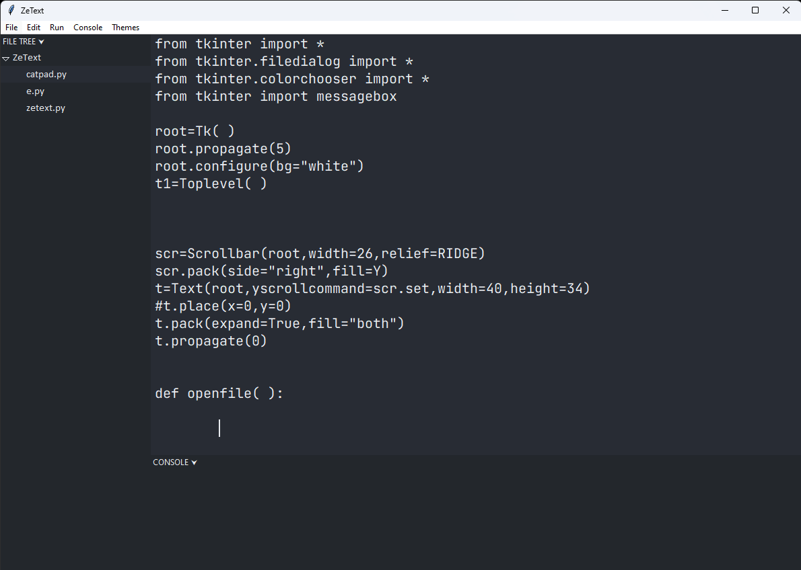

# ZeText
A code editor made using Tkinter in Python.

**NOTE:** *This project is still a work in progress, bugs and missing/incomplete features will be present.*

## Features
- Basic code editing
- Code running
- Easy theming
- Image displaying
